# PORTFOLIO PROJECT - 3

# BATTLE SHIPS

## PURPOSE

'Battleships' is the well known game which is strategy type guessing game. It is played on ruled grids (paper or board) on which each player's fleet of warships are marked. The locations of the fleets are concealed from the other player. Players alternate turns calling "shots" at the other player's ships, and the objective of the game is to destroy the opposing player's fleet.

The project has been developed using the Python programming language.

* Here is a link to the [final project](https://battleshipscifq.herokuapp.com/)

## DIFFICULTY LEVEL

The user can vary the difficulty level of the game. This is done by varying the grid-size. The lower the grid size, the lower the difficulty. The user can choose grid size of 8-15 (15 being the most difficult).

#  
## CONTENTS

- [USER STORIES](#user-stories)
- [FEATURES](#features)
    - [Gameplay Components](#gameplay-components)
        - [User vs AI](#user-vs-ai)
        - [AI vs User](#ai-vs-user)
    - [Future Features](#future-features)
    - [Images](#images)
    - [Typography](#typography)
- [TESTING](#testing)
    - [User story testing](#user-story-testing)
    - [Validation](#validation)
        - [PEP8](#pep8-online-validation)
    - [Manual testing](#manual-testing)
    - [Solved bugs and errors](#solved-bugs-and-errors)
    - [Unsolved bugs and errors](#unsolved-bugs-and-errors)
- [TECHNOLOGIES](#technologies)
    - [Development](#development)
    - [Languages used](#languages-used)
    - [Libraries used](#libraries-used)
- [DEPLOYMENT](#deployment)
- [CREDITS AND REFERENCES](#credits-and-references)
- [ACKNOWLEDGEMENTS](#acknowledgements)

#

## USER STORIES

* As a User, I want the game that I can set the difficulty
* As a User, I want the option to see how how many bombs I've left and how many ships are sunk
* As a User, I want to see how I performed compared to other users
* As a User, I want the option to play again

## FEATURES

* The game features are:
    * The user plays against a computer. The computer has 10 ships that are positioned randomly on the grid
    * The user has 50 bombs to use in the game
    * The user can set the level of difficulty by the size of the grid system. This is inputted at the start of game. The lower the grid-size, the easier the game.
    * The ship names are actual USS ship names
    * The game is over when the user runs out of bombs or all ships are sunk (whichever is first)
    * The users score is recorded and they get feedback on whether they got the top score or not

### Gameplay components:
#### User vs Computer

* A terminal with the title `Battleships` and `Enter your name:`

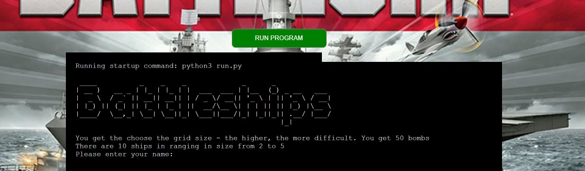

* Once the User name has been entered, the User is then asked `Please enter the grid size between 8 & 15:`

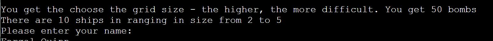

* Once the user enters the grid size - they are presented with the grid with ships hidden.

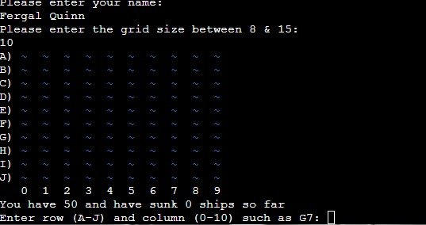

* The game starts with by the user entering the co-ordinates of where they want to drop the first bomb. There are various checks on the inputted co-ordinates like whether the row is a [letter and colum is a number](docs/images/invalid_entry.jpg). It also checks whether a bomb has been thrown at that co-ordinate before and [prompts user for another position](docs/images/already_thrown_a_bomb.JPG) if it has. 

* If the user [hits a ship](docs/images/ship_hit.jpg), a message is displayed and the co-ordinate is marked with an 'X' in red font. If the user [misses a ship](docs/images/missed-ship.jpg), a message is displayed and the co-ordinate is marked with an '#' in yellow font.

* If the User sinks a ships, the ship name is displayed. 

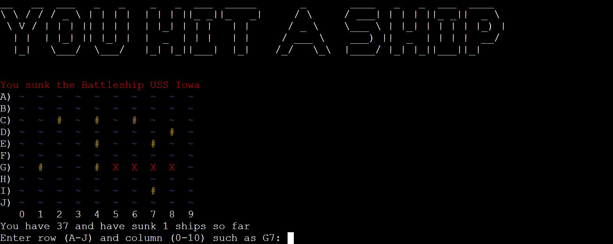

* The game finishes when the user either runs out of bombs or sinks all ships (whichever comes first). Then the user is provided feedback on how they did compared to users to date.

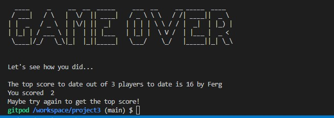

### Future features:

* Let the user choose the number of ships - this can increase the level of difficulty further.
* Introduce a 'super bomb' that can wipe out one cell and all surrounding cells at a time (up to 9 cells). The user will have one 'super bomb'
* At present, the user is advised at game end as to whether they got top score or not. I would like to have a leaderboard of the top ten scores

### Images

* There is one background image, for aesthetics only
    [Ultra Board Games](https://www.ultraboardgames.com/battleship/gfx/banner.jpg)

### Typography

* The project uses the [Art](https://pypi.org/project/art/) and [Colored](https://pypi.org/project/colored/) libraries for the ascii art and font color
* Otherwise, Standard terminal font, cannot be changed
# 

# TESTING

## User story testing

* `As a User, I want the game that I can set the difficulty`:
    *  On starting the game, the user is asked to provide a grid size with the note that `You get the choose the grid size - the higher, the more difficult.`. 
* `As a User, I want the option to see how how many bombs I've left and how many ships are sunk`:
    * The user is displayed with the following message at the start of game - `You have 50 and have sunk 0 ships so far`. The message is updated after each bomb is used 
* `As a User, I want to see how I performed compared to other users`:
    * At the end of the game, the user scores is calculated using the following formula - score = number of ships sunk x grid size. This adjusts the users score for difficulty
    * The users score is then compared to all previous users and they are informed whether they got the top score or not 
* `As a User, I want the option to play again`:
    * I have provided an option at the end of the game that asks 
        `Would you like to start a new game? Enter [Y/N]:`
        * If the User inputs `Y`, the game restarts and the grid is 
        the User vs AI with the original input difficulty. 
        * If the User inputs `N` the game ends with a message 
        `Thank you for playing Battleships!`.

## Validation
### PEP8 Online Validation

PEP8 Screenshot Results for game run file

 

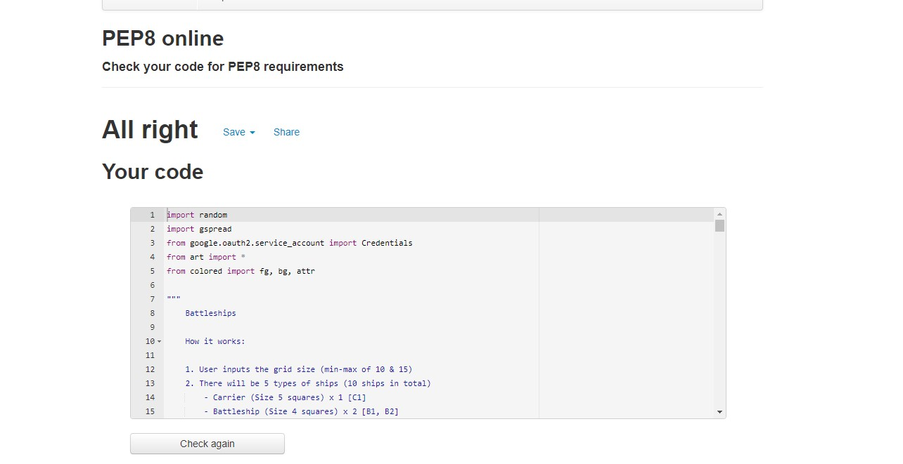

## Manual testing

- Upon loading the game screen terminal and entering their name:
    - The user is asked for the grid-size
        
        
    
    - If the using enters a non-numeric entry, the following message displays

        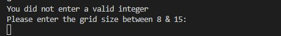

    - If the user enters a number less than 8 or greater than 15 - the following message displays

        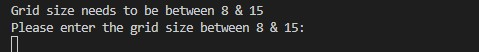
    
    - Once the game begins, the user is prompted for the co-ordinates for where a bomb is to be placed. There are a number of data entry checks to cover invalid data:
    
        - If incorrect data is entered, a `Error: Invalid Entry` message is displayed
          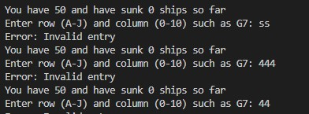

        - If coordinates are provided off the grid, an `Error: Your choice was off the grid`
            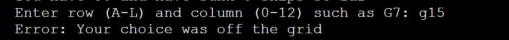

        - If the user positions a bomb where a bomb has already been placed, a message saying `Error: You have already thrown a bomb here`
            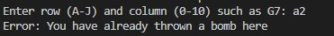
        
    - Once the game is over, the user is asked whether, they'd like to start another game of not - `Would you like to start again? Enter [Y/N]:`
        - If the user enters invalid data - the user will be promtped to enter data again and a message is displayed with `Invalid entry - please try again`
           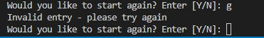 
    
    
## Solved bugs and errors

* Throughout the development of this project, several automated (flake8) errors have been fixed i.e.
    - Indentation errors
    - Undefined variable name
    - Not enough whitespace between functions
    - No new line at end of file
    - Invalid syntax errors
    - Imported but unused errors
    

* Found an issue with `AI vs User`, where there was a double input of the User controls of `H L or C`, for example,
    if the User is thinking of 5 and AI guessed 4, the User would input H for higher, but two H H would appear on seperate lines.
    - This was fixed by removing a missed duplicate print() statement.
* Found an issue with restart game function, the option to restart the game would appear during the `AI vs User` game,
    or wouldn't appear at all.
    - This was a complete oversight, I had simply placed the function at the end of the file, logically, the `end_game()` function needed to be placed above `user_guess` and `computer_guess` functions in order to be called after the game ended.
    - Importing `sys` for `sys.exit()` also cured the issue of the game not ending in the same function.
* Any duplicate or unused code, comments etc have been removed
* Any irrelevant space in between code has been removed

## Unsolved bugs and errors

* When the game comes to an end and the User requests to restart the game, the game loops back to User vs AI, 
    without the possibility of inputting a new number for difficulty purposes. The game does run as normal apart from this issue
* All previously known errors during the development process have been resolved

#
# TECHNOLOGIES

## DEVELOPMENT

* The project was written and tested using [Gitpod](https://gitpod.io/)
* The project uses [Github](https://github.com/) for utilising git version control
* The project was deployed via [Heroku](https://heroku.com/)

## LANGUAGES USED

* The project was written using [PYTHON3](https://en.wikipedia.org/wiki/Python_(programming_language))

## LIBRARIES USED

* Colored
    - This is used to color some of the text. This makes the grid more readable to the user
        
* Art
    - This library was used to create the ASCII art for the title upon loading the game

#
# DEPLOYMENT

## Heroku

* This Game was deployed using [Heroku](https://heroku.com/) with the following the steps:

1. Navigate to [Heroku.com](https://www.heroku.com/) and log-in or create a new account.
2. On the top right hand side, click the 'New' button.
3. Inside the dropdown menu, select 'Create new app'.
4. Create a new name for your app (making sure the name chosen is available) in this case it is `battleshipscifq`.
    App names can only be in lower-case letters, numbers and dashes.
5. Select your region, in this case, `Europe`.
6. Click on the `Create App` button.  
7. This will create your app in Heroku and take you to the [Heroku](https://heroku.com/) dashboard.
8. Navigate to the settings tab and scroll down to the button `Reveal Config vars`.
9. Replace the word `KEY` and enter `PORT` and then replace the word `VALUE` and enter `8000` then click on the `Add` button.
10. Below `Config vars` is `Buildpacks`. Click the `Add Buildpack` button.
11. In the pop up window, select `python` and save changes.
12. Repeat this again but this time selecting `node.js` and save the changes.
13. It is `important` to make sure the buildpacks are in the correct order 
    with `Python` being at the top and `node.js` bottom. If they are not in the correct order, you can drag them into the right order.
14. Next, navigate to the `Deploy` tab at the top left side.
15. Select `Github, 'connect to github'` as the deployment method.
16. Search for the Github Repository in the search field (in this case `Python_PP3`) and click `Search`.
17. When the search is complete, click `connect`.
18. Once your repository is connected to [Heroku](https://heroku.com/), Click the `Enable Automatic Deploys` button for automatic deployment.
19. Alternatively you can manually deploy by selecting a branch to deploy from and clicking `Deploy Branch`.
20. If you choose to `Enable Automatic Deploys`, [Heroku](https://heroku.com/) will build a new version of the app when a change to 
    `gitpod` is pushed to `Github`.  
21. Manual deployment allows you to update the app whenever you click `Deploy Branch`.
    In the case of this project, I chose to `Enable Automatic Deploys` to ensure the code was deployed straight away at each push from `Gitpod`.
22. Once the build process is complete (this can take a few seconds) you will then be able to view the live app by clicking on the button `View`
    below `Your app was successfully deployed`.

## Version control

* These commands were used for version control during project:

    * git add `example filename` - to add files before committing
    * git commit -m `"example message"` - to commit changes to the local repository
    * git push - to push all committed changes to the GitHub repository
    * git branch - to see which branch currently working on
    * git pull - to pull all code into main branch once the feature branch had been merged and deleted
    * git status - to see if the branch currently working on is upto date or if the are any unstaged
    * git log --oneline - to see the last commit
    * git commit --amend - to amend the most recent commit message

## How to create a branch/Tag of main:

If you need to `BRANCH` off of the main repository:

1. If you have not already, login in to [GitHub](www.github.com) and go to https://github.com/Chr15w1986/Python_PP3
2. On the left side of the screen underneath the nav links, click the drop down box `Main`
3. Inside the box you will see `Create new branch/tag`
4. Inside the text box, enter the new branch or tag name i.e., `Features`
5. Below the Branches Tags tab, you will see `Create branch: Features from "main"`
6. Click on `Create branch: Features from "main"` and you will be taken to the new branch page you just called `Features`

## How to fork a repository:

If you need to `FORK` a repository:

1. If you have not already, login in to [GitHub](www.github.com) and go to https://github.com/fergalquinn77/project3.git
2. In the top right corner, click `Fork`
3. The next page will be the forked version of https://github.com/fergalquinn77/project3.git but in your own repository
## How to clone a repository:

If you need to make a clone of this repository:

1. Fork the repository https://github.com/fergalquinn77/project3.git using the steps above
2. Above the file list, click `Code` (Usually green at the top right of the code window)
3. Choose if you want to clone using HTTPS, SSH or GitHub CLI, then click the copy button to the right
4. Open Git Bash
5. Change the directory to where you want your clone to go (your own github)
6. Type `git clone` and then paste the URL you copied in step 4
7. Press `Enter` to create your clone

## How to make a local clone:

If you need to make a local clone:

1. If you have not already, login in to [GitHub](www.github.com) and go to https://github.com/fergalquinn77/project3.git
2. Under the repository name, above the list of files, click `Code`
3. Here you will have two options, `Clone` or `Download` the repository
4. You should close the repository using HTTPS, clicking on the icon to copy the link
5. At this point, you can launch the `Gitpod workspace` or choose your own directory
5. Open Git Bash
6. Change the current working directory to the new location of where you want the cloned directory to be
7. Type git clone and then paste the URL you copied in step 4
8. Press Enter, to create your local clone to your chosen directory

#
## CREDITS AND REFERENCES

### IMAGE

* Background image of numbers collage, [IStockphoto](https://www.istockphoto.com/search/2/image?phrase=numbers)

### CODE

* [W3Schools](https://www.w3schools.com/) for an interesting read on python functions and how they can be implemented
* [Stackoverflow](https://stackoverflow.com/questions/57409696/imported-but-unused-in-python) For an unused import error I was experiencing
* [Stackoverflow](https://stackoverflow.com/questions/27076239/adding-scoring-system-to-a-number-guessing-game-including-play-again)
    For a rough guide on how to implement a restart game function

#
## ACKNOWLEDGEMENTS:

- Code institute for the amazing Tutors on the course
- My brilliant Mentor Ben Kavanagh, [BAK2K3](https://github.com/BAK2K3) for his advice on my code, pushing me back on track 
    when I start to lose faith, taking time out of his own day and duties to answer ALL of my questions with utter perfection!
- Dave Horrocks [DaveyJH](https://github.com/daveyjh), again! for giving me time out of his own studies, for his patience, helping me above and beyond.
- Shellie Downie [ShellieD](https://github.com/shellieD), for her support, pointing out an obvious issue with my code so quickly.. TWICE! after hours of staring at it and looking straight over the problem.
- My family for their support, patience and testing!!
- My wonderful fiancée for being my personal spell checker/grammer police and for listening to me when I need to rant!
- Everybody on Slack for tips, advice, quick fixes and support

#### RETURN TO THE [TOP](#numberex)